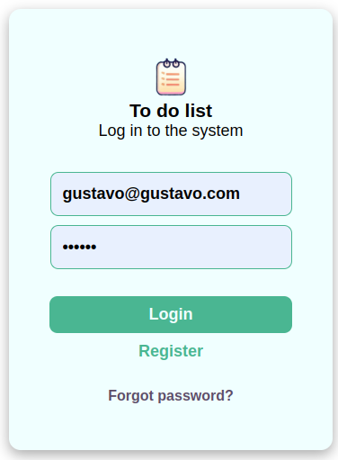
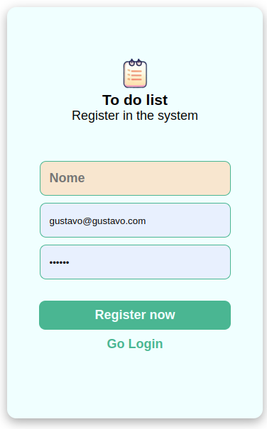
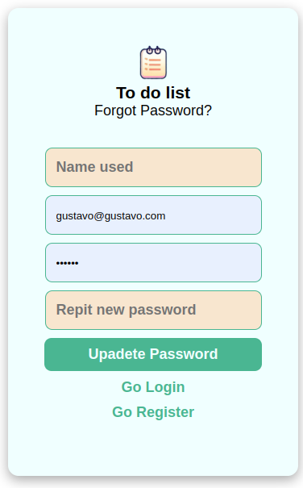
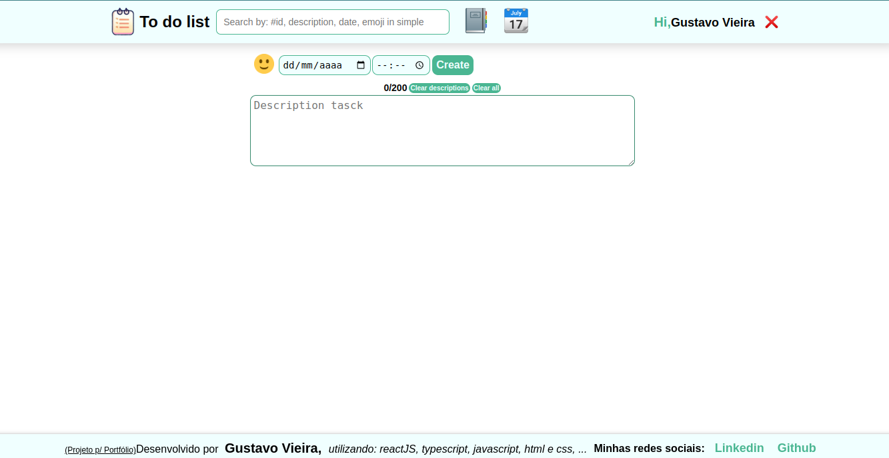
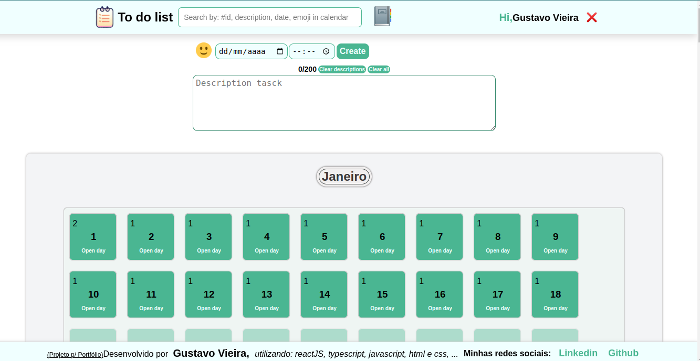
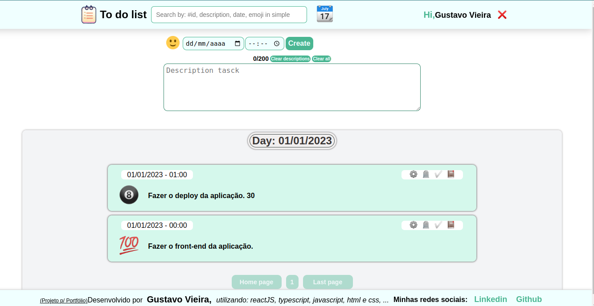

# Projeto To-do-list

## Descrição

Esse é um projeto Full-stack para o portfólio de Gustavo Vieira. Ele funciona como um sistema C.R.U.D (Create, Read, Update e Delete) que armazena tarefas de um usuário em um banco de dados MySQL.

## Stacks envolvidas

- Docker
- CSS3
- HTML5
- React.js
- JavaScript
- TypeScript
- JWT
- EsLint
- Express.js
- Joi
- Sistema MSC (Model, Services e Controllers)
- MySQL
- Sequelize
- Jest (Testes unitários)

## Como iniciar o projeto to-do-list usando Docker

Observações:

- É necessário ter o Node.js instalado em um sistema baseado em Linux e de preferência usar a IDE VScode.
- Para que o sistema To-do-List funcione corretamente, as portas 3000 (Front-end), 3001 (Back-end) e 3002 (Banco de dados) devem estar liberadas.

Passos:

1. Faça a clonagem do repositório [https://github.com/Gusvioli/to-do-list](https://github.com/Gusvioli/to-do-list) do GitHub em um diretório de sua escolha. Utilize o comando `git clone git@github.com:Gusvioli/to-do-list.git` em um terminal associado ao diretório escolhido.
2. Abra o terminal associado ao diretório onde o projeto foi clonado e digite `npm run up:build:d` para subir o container Docker em segundo plano, ou digite `npm run up:build` para subir o container Docker em primeiro plano.
3. Aguarde o container Docker subir.
4. Abra seu navegador e digite [http://localhost:3000/](http://localhost:3000/) para acessar o Front-end e [http://localhost:3001/](http://localhost:3001/) para o Back-end.
5. Caso queira testar sem a necessidade de criar uma conta utilize o ***login: <gustavo@gustavo.com.br> com a senha: 123456***

Em caso de dúvidas, entre em contato comigo pelo GitHub ou pelo e-mail: <gustavovieiradeoliveira@gmail.com>.

 

### Esse projeto está sendo executado em um servidor privado(usando Docker) com o endereço IP: <http://187.67.70.21:3000/> para o front-end e <http://187.67.70.21:3001/> para o Back-end

 

### Página de login

### Página de Registro

### Página de Recuperação de login

### Página Inicial

### Página de Calendário

### Página de Listas de tarefas

